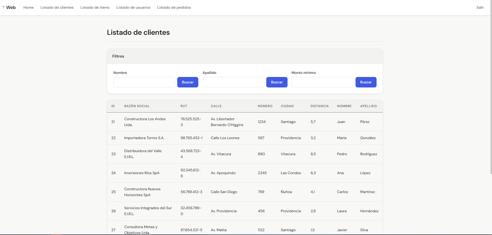
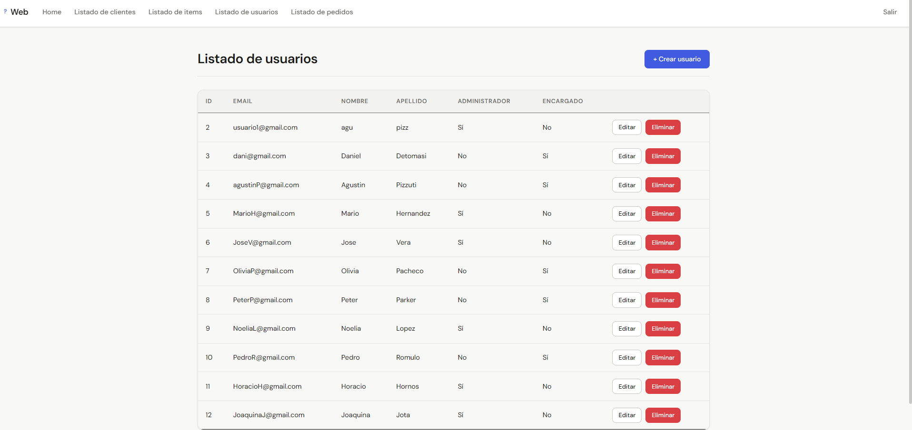
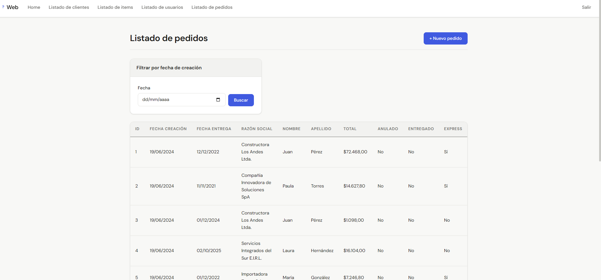
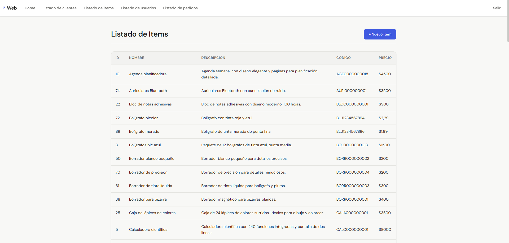
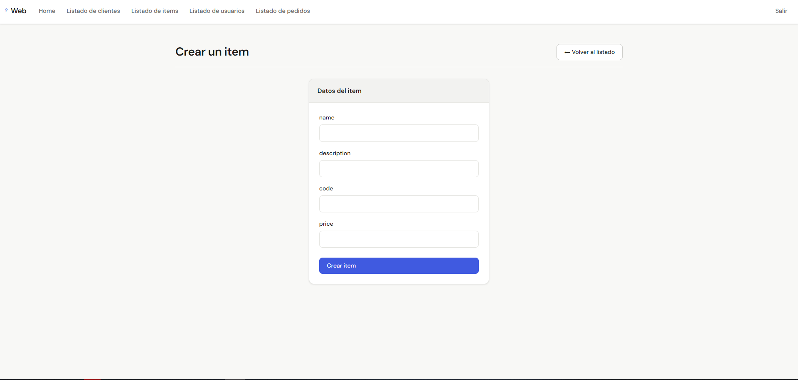
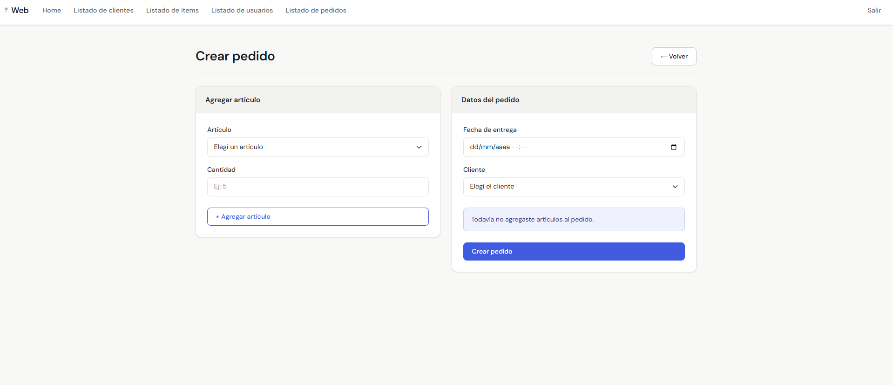
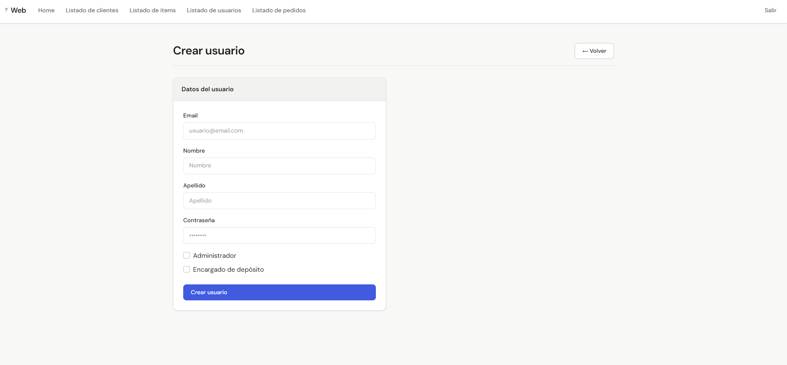
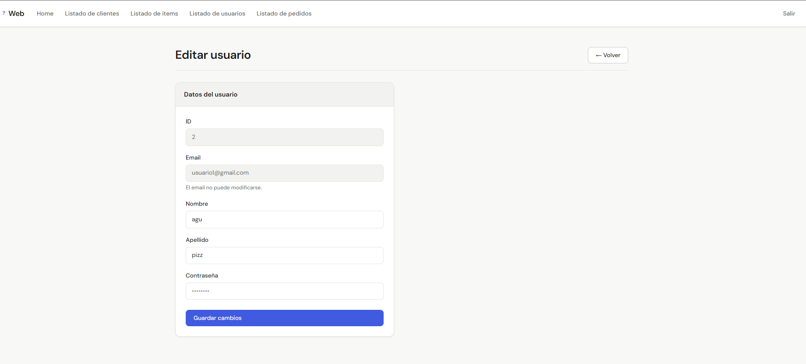
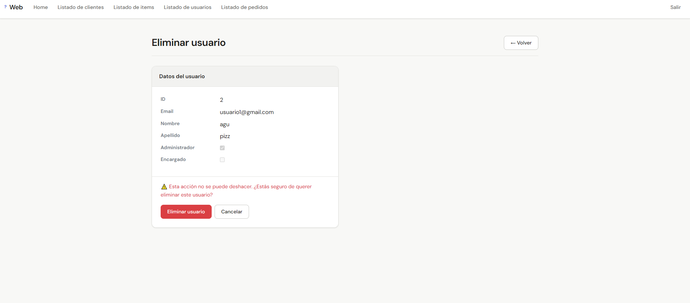

# Sistema de Gestión de Pedidos y Depósito

Este sistema fue desarrollado para una empresa de papelería con el objetivo de optimizar la gestión de pedidos de clientes corporativos y el control de inventario en depósito.

La aplicación fue construida aplicando principios de **Clean Architecture** y **Domain-Driven Design (DDD)** para garantizar escalabilidad, mantenibilidad y separación de responsabilidades.

---

##  Funcionalidades Implementadas

### 1. Gestión Comercial (Módulo Administrador)

#### Gestión de Usuarios
- CRUD completo de usuarios
- Contraseñas encriptadas
- Políticas de seguridad:
  - mínimo 6 caracteres
  - una mayúscula
  - una minúscula
  - un dígito
  - un símbolo especial

#### Catálogo de Artículos
- Administración de insumos
- Validación de códigos de 13 dígitos
- Descripciones mínimas
- Control de stock

#### Gestión de Clientes
- Búsqueda por nombre
- Búsqueda por volumen de facturación acumulada

#### Sistema de Pedidos
##### Pedidos Comunes
- Recargo del 5% si la distancia supera los 100 km

##### Pedidos Express
- Recargo general del 10%
- Recargo del 15% para entrega en el mismo día
- Plazo máximo de entrega de 5 días

##### Anulación de Pedidos
- Selección de pedidos no entregados
- Registro histórico de anulaciones

---

### 2. Gestión de Depósito (Módulo Encargado)

#### Movimientos de Stock
- Registro de ingresos
- Registro de egresos
- Acceso exclusivo para usuarios con rol **Encargado**

#### Tipos de Movimiento
- CRUD de categorías:
  - Compra
  - Venta
  - Devolución
- Restricción de eliminación si existen movimientos asociados

#### Consultas Paginadas
- Historial de movimientos por artículo y tipo
- Reporte por rango de fechas
- Resumen anual agrupado por tipo de movimiento

---

##  Arquitectura y Patrones

El proyecto se basa en una separación estricta de responsabilidades utilizando **Clean Architecture**.

### Domain / BusinessLogic
Contiene:
- Entidades del dominio
- Value Objects
- Reglas de negocio
- Validaciones complejas

### Data Access
Implementación de persistencia con **Entity Framework Core 8**.

Patrones utilizados:
- Repository

### Web API
- Endpoints REST
- Autenticación mediante JWT
- Respuestas con status codes apropiados
- Documentación con Swagger

### Cliente Web MVC
- Aplicación independiente
- Consumo de API mediante HttpClient
- Uso de ViewModels y DTOs

---

##  Credenciales de Prueba

**Usuario:** `usuario1@gmail.com`  
**Contraseña:** `User1.`

---

##  Instrucciones de Ejecución

Para ejecutar correctamente el sistema se debe respetar el siguiente orden:

### 1. Ejecutar la API
Primero debe iniciarse el proyecto **Web API**, ya que la aplicación web consume sus servicios.

### 2. Ejecutar la aplicación Web
Una vez iniciada la API, debe ejecutarse el proyecto **Web MVC** para acceder a la interfaz del sistema.

## 📷 Capturas del sistema

### Listado de Clientes

### Listado de Usuarios

### Listado de Órdenes

### Listado de Items

### Alta de Item

### Alta de Orden

### Alta de Usuario

### Edición de Usuario

### Eliminación de Usuario

